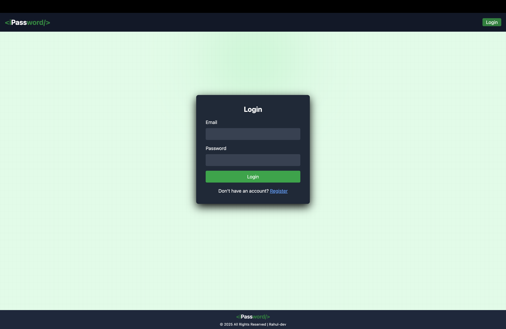
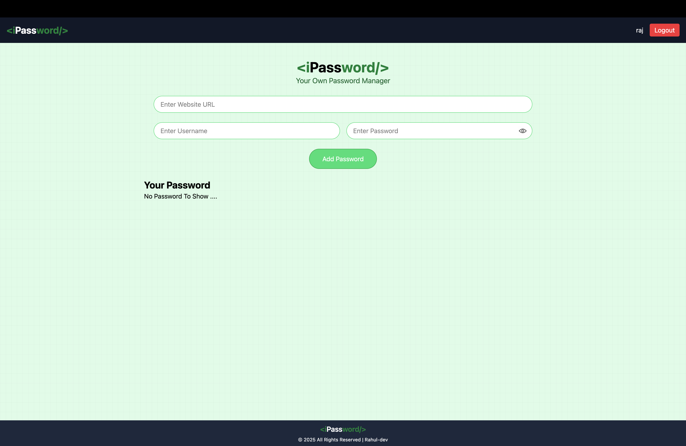
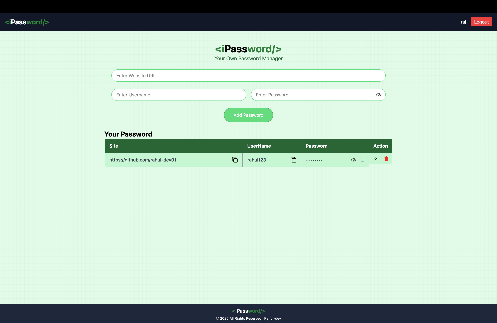

# 🔐 iPassword – Your Own Password Manager  

A **secure and lightweight password manager** built using the **MERN Stack**.  
With iPassword, you can safely store, manage, and access your credentials for different websites all in one place.  

---

## ✨ Features  

- ✅ Add, view, edit, and delete saved credentials  
- ✅ Password masking with **show/hide** toggle  
- ✅ **Copy to clipboard** for instant username & password usage  
- ✅ Secure **authentication & logout system**  
- ✅ Responsive & clean UI with modern styling  
- ✅ User-specific password storage  

---

## 📸 Screenshots  

### 🏠 Login Screen  
  

### 🗂️ Home Screen
   

   

---

## 🛠️ Tech Stack  

- **Frontend:** React.js, Tailwind CSS  
- **Backend:** Node.js, Express.js  
- **Database:** MongoDB (with Mongoose)  
- **Authentication:** JWT (JSON Web Token)  

---

## 🚀 Getting Started  

Follow these steps to run the project locally:  

### 1️⃣ Clone the Repository  
```bash
git clone https://github.com/your-username/ipassword.git
cd ipassword
